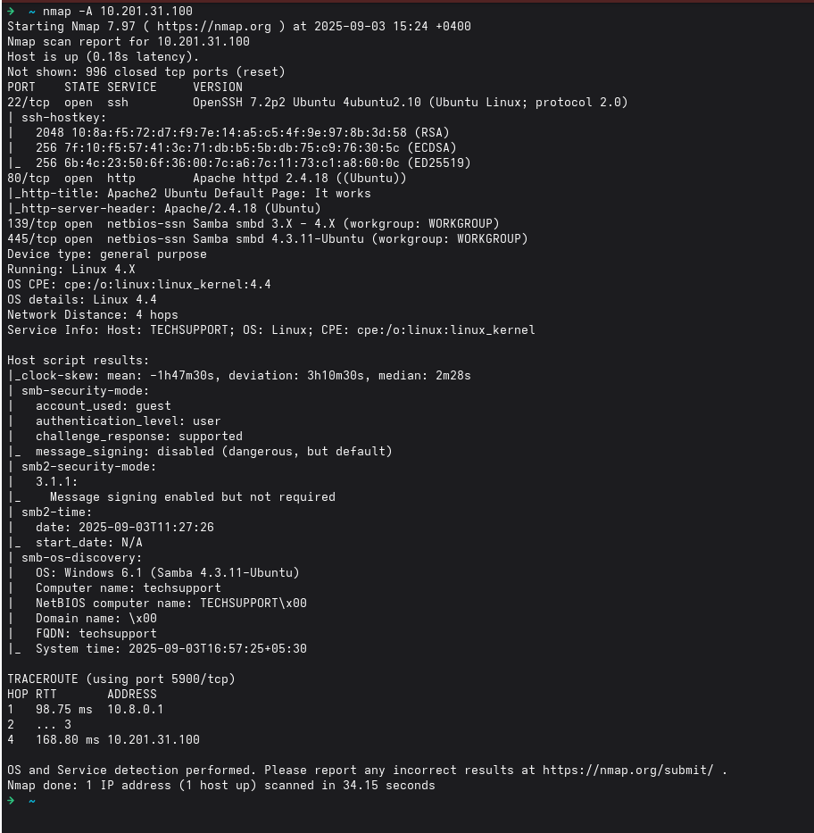
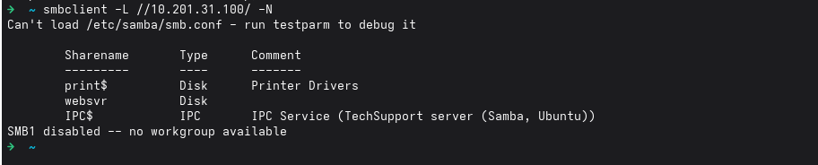

# Tech_Supp0rt: 1 - TryHackMe Writeup

## Description
Tech_Supp0rt: 1 is a beginner-friendly box on TryHackMe designed to simulate a real-world technical support scenario. The challenge involves identifying vulnerabilities, exploiting misconfigurations, and escalating privileges to gain root access. This writeup documents the step-by-step approach taken to solve the machine, focusing on practical techniques and learning outcomes.

**Note:** Metasploit was not used during the solution of this machine. All exploitation and enumeration were performed manually to encourage deeper understanding of the underlying processes.

---

## Enumeration
For enumeration I used a simple nmap scan with the key -A (which includes -sC - simple scripts, -sV - port and services scan, -O - OS detection):

```bash
nmap -A 10.201.31.100
```



The scan has identified 4 open ports:
- 22: SSH
- 80: HTTP
- 139: Legacy SMB file sharing
- 445: Current standard for SMB file sharing

The detailed nmap scan also revealed that the security for Samba is relatively weak and can be accessed in guest mode (no authenticaion), so I will start with searching through the samba shared files.

This command lists all the available shares (-L) on the target as well as supresses the password prompt, since we already know that a connection can be established with a guest account:

```bash
smbclient -L //10.201.31.100/ -N
```



