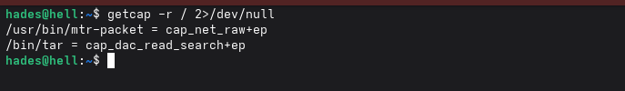
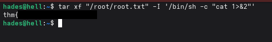

# The Server From Hell - TryHackMe Writeup

## Description
The Server From Hell is a medium-level challenge on the TryHackMe platform. This lab stands out by encouraging the use of manually written scripts or adapting existing ones to capture the flags. Personally, I learned a lot while attempting this challenge and highly recommend it for anyone looking to improve their practical skills.

**Note:** Metasploit was not used during the solution of this machine. All exploitation and enumeration were performed manually to encourage deeper understanding of the underlying processes.

---

## Enumeration

As soon as we join the challenge, we are advised to "Start at port 1337 and enumerate your way.", so this is what we are going to do.

We can use telnet to establish a session to the machine:


The message states that we must find a trollface hiding in the banners of sessions of the first 100 port. Banners are the messages printed as the last line before the "Connection close by foreign host" message. So, let's create a script printing those lines from the connection of the first 100 ports. The script shall accomplish that through the following steps:
- Connect via telnet to the session (IP + port number)
- Sanitize the output, so that only the banner is printed
- Do the same for the next port until the port 100 is reached

Using AI, I created the following script:

```bash
#!/bin/bash

TARGET_IP="IP"
MAX_PORT=100

echo "Scanning ports 1 to $MAX_PORT on $TARGET_IP..."
echo "----------------------------------------"

for port in $(seq 1 $MAX_PORT); do
    echo -n "port $port: "
    
    output=$(telnet $TARGET_IP $port)
    echo $output | tail -n 1
    
    sleep 0.1
done

echo "----------------------------------------"
echo "Scan completed."
```

**Note:** I uploaded the script into the assets directory.


Create a simple .sh file and add the rights to execute it using the command `chmod +x NAME_OF_YOUR_SCRIPT.sh`. Afterwards, launch it ./NAME_OF_YOUR_SCRIPT.sh, and this is what you are going to see:


As we can see, one of the banners tells us to "go to port 12345", so let's do that:


The banner of the session with port 12345 informs us about the NFS share available on the server. We can locate and mount the share using `nfs-utils` package, if you do not already have it, download it.


Using the showmount command with the key -e (Shows the export lists of the NFS server) we can list the available shares:


The output indicates that the share /home/nfs is available, so let`s mount it to our device:
- Create a directory which will be used to mount the NFS share:
```bash
mkdir /mnt/nfs
```
- Mount the share to your device:
```bash
mount -t nfs server_ip:/home/nfs /mnt/nfs
```
- List the shared directory:
```bash
ls /mnt/nfs
```
- Copy the files in the share to your working directory.

- Unmount the share
```bash
umount /mnt/nfs
```


The only file located on the share was `backup.zip`. Trying to unzip the archive, we can see that it is encrypted with a passkey:


Let's bruteforce our way in. There are multiple tools for that, however I used `fcrackzip` with a `rockyou.txt` wordlist. If you wish to use the same tool, here is the command:

```bash
frackzip -u -D -p /path/to/wordlist backup.zip
```


There it is! The passkey to the archive is **zxcvbnm**. Let's unzip it:


Listing the /home/hades directory reveals a .ssh directory containing:
- **authorized_keys** file: Stores public SSH keys that are allowed to authenticate and log in to the user account without a password.
- **flag.txt**: One of the challenge flags
- **hint.txt**: A hint we will examine
- **id_rsa**: The private SSH key used for secure authentication.
- **id_rsa.pub**: The public SSH key corresponding to id_rsa. It can be added to authorized_keys on remote systems to allow key-based authentication.

Viewing the `authorized_keys` file, we observe the following:


The comment at the end indicates that these ID files belong to the user `hades`, and the hostname of the machine is `hell`. I will use `hell` as the hostname for all following steps. You can do the same or continue using the IP address; it makes no difference.

**Note:** If you wish to use the hostname option, make sure to add it to your `/etc/hosts` file.

Here is the first flag.


Let's take a look at the hint.


The range 2500-4500 likely refers to possible SSH port numbers. Since we have the private key (`id_rsa`) and its public counterpart (`id_rsa.pub`) matches the entry in `authorized_keys`, we can authenticate to the server via SSH without a password. Our next step is to identify which port within the 2500-4500 range is running the SSH service.

There are multiple ways to approach this. We could use `nmap` with the `-sV` option to identify services running on the 2000 ports in the specified range, but this would take a considerable amount of time. Tools like `medusa` and `hydra` are commonly used for brute-forcing SSH passwords; however, in our case, we already have the private key (`id_rsa`), and these tools are not intended for identifying SSH ports.

In my opinion, the best way to proceed is to create our own script. This script should:
- Attempt to establish an SSH connection using the private key (`id_rsa`) to each port in the 2500-4500 range.
- Check for lines such as 'Connection reset' to omit the output of unsuccessful connections.
- Report which port successfully establishes an SSH connection.

Here is the script I made with the help of AI:

```bash
#!/bin/bash

# Configuration
HOST="hell"
USER="hades"
KEY_FILE="id_rsa"
START_PORT=2500
END_PORT=4500
THREADS=50

# Set proper key permissions
chmod 600 "$KEY_FILE"

echo "🔍 Scanning ports $START_PORT to $END_PORT for abnormal SSH responses..."
echo "Target: $USER@$HOST"
echo "--------------------------------------------"

# Function to test a single port
test_port() {
    local port=$1
    local output
    local last_line
    
    # Capture SSH output with timeout
    output=$(timeout 4 ssh -o BatchMode=yes -o ConnectTimeout=3 -o StrictHostKeyChecking=no \
                         -i "$KEY_FILE" -p $port $USER@$HOST 2>&1)
    
    # Get the last line
    last_line=$(echo "$output" | tail -1)
    
    # Check if last line does NOT contain typical connection reset/refused messages
    if ! echo "$last_line" | grep -q "Connection reset by\|Connection refused\|Connection closed\|No route to host\|invalid format\|timed out"; then
        if [ -n "$last_line" ]; then
            echo "Port $port: $last_line"
        else
            echo "Port $port: No typical error message (different response)"
        fi
    fi
}

export -f test_port
export HOST USER KEY_FILE

# Scan all ports in parallel, wait for all to complete
seq $START_PORT $END_PORT | xargs -I {} -P $THREADS bash -c 'test_port "$@"' _ {}

echo "--------------------------------------------"
echo "Scan completed. Check above for ports with unusual responses."
```

**Note:** This script was also added to the assets directory.

The script uses threads to reduce the wait time, as scanning 2000 ports can take a long time.

**Keep in mind:** For this script to work properly, you must specify all parameters in the configuration settings correctly. For example, if the `id_rsa` file is not located in the same directory as this script, provide the full path to the key file; otherwise, it will not work.

Now, let's launch the script and observe the output:


After the script completes, we are left with one port: 3333.

Let's connect to that port using the key file:

```bash
ssh -i id_rsa -p 3333 hades@hell
```


This is not your ordinary console. When trying to execute simple SHell command you may observe that it gives out an error. This is because this is an IRB (Interactive Ruby) shell. After doing some research, I found a simple command to give us a bash shell:

```bash
system("/bin/bash")
```

And there we have it, a familiar looking bash shell!


A simple `ls` command reveals the `user.txt` file - the second flag for this challenge.


Now, to get the last flag, we must probably perform a Local Privilege Escalation (LPE). After checking /etc/passwd and SUID files, I found nothing. However, upon reviewing the available capability binaries I found this:

```bash
getcap -r / 2>/dev/null
```



`tar` being on there, definitely seems odd to me. Let's check GTFObins:

[https://gtfobins.github.io](https://gtfobins.github.io/)


With the following command, we can abuse the `tar` capabilities to read the `/root/root.txt` file:

```bash
tar xf "/root/root.txt" -I '/bin/sh -c "cat 1>&2"'
```



And there we have it—the final flag, completing the challenge!

**Thanks for visiting!**